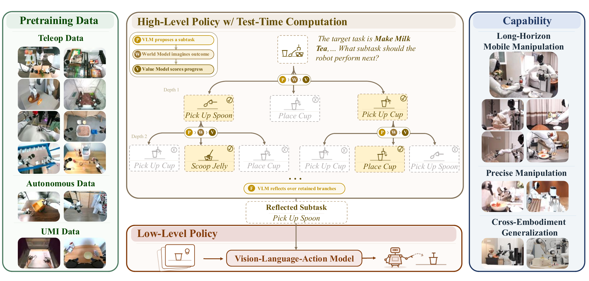
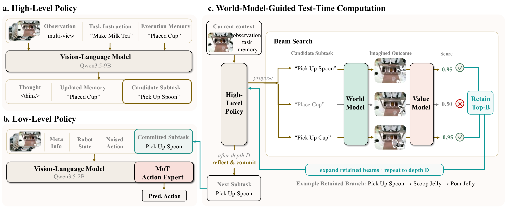

<div align="center">

# τ₀-VLA: a Hierarchical Robot Foundation Model with World-Model-Guided Test-Time Computation

[Project website](https://tau0-vla.github.io/) ·
[Model checkpoint](https://huggingface.co/PLACEHOLDER)

</div>



τ₀-VLA is a hierarchical robot foundation model for long-horizon
manipulation. A memory-augmented high-level policy generates the next subtask
and can allocate additional test-time computation to consequential decisions.
It proposes candidate subtasks, predicts their visual outcomes with a world
model, scores task progress, and reflects on the retained search branches
before committing. A generalist low-level policy then executes the selected
subtask across robot embodiments.

The low-level policy combines a Qwen3.5 vision-language backbone with a
Mixture-of-Transformers action expert trained through conditional flow
matching. It uses a unified 40-dimensional state/action representation
covering end effectors, arm joints, grippers, waist, and mobile-base velocity.
The model was trained on 40,115 hours of heterogeneous real-world robot data
with multimodal co-training.



## Release contents

This repository currently releases the low-level τ₀-VLA post-training and
inference stack:

- Qwen3.5 + Mixture-of-Transformers VLA implementation
- a unified 40D multi-embodiment data and action contract
- fine-tuning, normalization-statistics, serving, and open-loop evaluation code
- a self-contained AgiBot World example with three camera views, language
  instructions, joint state/action, masks, and normalization statistics
- a warm-start checkpoint for post-training (Hugging Face link above is a
  placeholder until upload)

The released checkpoint is a training starting point, not a directly
deployable robot policy. A post-training run writes its own data contract and
policy manifest, which are required for serving and evaluation.

## Installation

The reference environment is Python 3.11, CUDA 12.8, and PyTorch 2.7.1.
Starting from a clean CUDA image:

```bash
git clone git@github.com:sii-research/tau-0-vla.git
cd tau-0-vla
bash scripts/setup.sh
```

`flash-attn` is compiled against the local PyTorch/CUDA installation. Override
`PYTORCH_INDEX_URL` when using another compatible CUDA wheel source, and reduce
`MAX_JOBS` if compilation is memory constrained.

## Checkpoint

Download the public checkpoint from the Hugging Face link above. The release
checkpoint contains only these inference/post-training artifacts:

```text
chat_template.jinja
config.json
model.safetensors
processor_config.json
tokenizer.json
tokenizer_config.json
```

Training state, optimizer state, scheduler state, RNG state, trainer state,
internal run manifests, and the original pretraining configuration are not
part of the public checkpoint.

## Worked AgiBot World example

[`example_data/`](example_data/README.md) is a 25-episode “Strike the gong”
subset derived from AgiBot World Alpha and stored in LeRobot v3.0 format. It
contains 9,469 frames, three 640×480 video streams, and episode/segment-level
language instructions.

The corresponding recipe is
[`configs/example_agibot_world_gong/`](configs/example_agibot_world_gong/README.md).
Launch post-training with:

```bash
bash scripts/train.sh configs/example_agibot_world_gong/train.yaml \
    --model_name_or_path /path/to/tau-0-vla-checkpoint
```

The public G1 example is joint-controlled. It reads:

| model input/target | dataset source | unified slots |
|---|---|---|
| left/right gripper | state/action indices `[0, 1]` | `[18:20]` |
| left arm joints | state `[28:35]`, action `[16:23]` | `[24:31]` |
| right arm joints | state `[35:42]`, action `[23:30]` | `[32:39]` |
| instruction | `instruction_segments` metadata | prompt text |
| cameras | top head, left hand, right hand | head and two wrist views |

Joint actions are relative to the current joint state; gripper actions remain
absolute. The remaining unified slots are zero-padded and masked. The release
does not include the G01 URDF and does not derive EEF poses from joints.
Datasets with native EEF values may use the generic native-EEF path; datasets
with joint values stay in joint space.

If you change the example data, horizon, or frame filter, recompute its
normalization statistics:

```bash
PYTHONPATH=src:. python3 scripts/norm_stats/compute_unified_ft_stats.py \
    --body g1_agibot_unified \
    --action-horizon 30 \
    --repos example_data \
    --positive-labels l3 \
    --negative-labels \
    --partials-dir /tmp/agibot_world_gong_stats

PYTHONPATH=src:. python3 scripts/norm_stats/merge_stats.py \
    --partials /tmp/agibot_world_gong_stats \
    --out configs/example_agibot_world_gong/norm_stats.json
```

## Validate a release on one GPU

After installation, run the end-to-end smoke check in a clean GPU environment:

```bash
bash scripts/validate_gpu_release.sh \
    /path/to/tau-0-vla-checkpoint \
    /tmp/tau0-vla-smoke
```

The script checks the six-file checkpoint boundary, rejects absolute source
paths and training-state artifacts, loads a real example batch, verifies CUDA
and bfloat16 support, and performs one post-training optimization step.

## Serving and evaluation

A completed post-training directory carries `finch_data_spec/` and
`policy_manifest.json`; inference reads the stored contract rather than a
training config.

```bash
python -m deploy.server --model outputs/<run_name>
```

```bash
python deploy/openloop.py --ckpt outputs/<run_name> --no-plot
```

Before sending actions to hardware, inspect
`build_sdk_action_perm` in
[`src/tau0_vla/adapters/g1/deploy_io.py`](src/tau0_vla/adapters/g1/deploy_io.py).
It maps the unified output order back to the robot SDK’s native action order.

## Repository layout

```text
src/tau0_vla/
├── adapters/    embodiment-specific data layouts and deployment I/O
├── data/        LeRobot loading, prompting, masking, normalization, 40D layout
├── models/      Qwen3.5 backbone and flow-matching action expert
├── trainer/     post-training entry point
├── vlm/         multimodal collation and tokenization
└── utils/       logging and run specifications
configs/         reusable template and the AgiBot World example
deploy/          policy server and open-loop evaluation
example_data/    bundled AgiBot World subset
scripts/         setup, training, statistics, and release validation
```

For a new dataset or embodiment, start with:

- [`configs/_template/`](configs/_template/README.md)
- [`src/tau0_vla/data/DATASET_FORMAT.md`](src/tau0_vla/data/DATASET_FORMAT.md)
- [`src/tau0_vla/adapters/`](src/tau0_vla/adapters/README.md)
- [`deploy/`](deploy/README.md)

## Citation

Paper and BibTeX metadata will be added when the paper link is public.

## License

The code and model release are provided under the
[Apache License 2.0](LICENSE), following
[τ₀-World Model](https://github.com/sii-research/tau-0-wm).

The files under [`example_data/`](example_data/README.md) are derived from
AgiBot World Alpha and are separately licensed under
[CC BY-NC-SA 4.0](https://creativecommons.org/licenses/by-nc-sa/4.0/).
